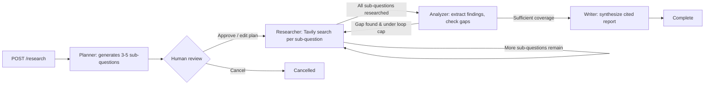

# Multi-Agent Research Assistant

An orchestrated ensemble of AI agents — planner, researcher, analyzer, and writer — that break down a research question, search the web, self-check for gaps, and synthesize a cited report. Built with LangGraph, FastAPI, Groq, and Tavily, with a human-in-the-loop approval step between planning and execution.

## What this is (and isn't)

This project demonstrates multi-agent orchestration, human-in-the-loop control, and stateful graph design patterns using LangGraph. It is **not** intended to compete with production research tools like Perplexity or ChatGPT's Deep Research — the value here is architectural: a shared state graph with conditional branching, an interruptible workflow a human can review mid-run, and full observability into how the agents reasoned and looped, not raw research quality at scale.

## Architecture



## Agents

- **Planner** — breaks the original question into 3-5 sub-questions. Explicitly prompted to make each sub-question probe a genuinely distinct facet (technique, production considerations, evaluation methods, trade-offs, comparisons) rather than reworded variants of the same angle.
- **Researcher** — runs a Tavily web search per sub-question, one at a time, storing trimmed result snippets in shared state.
- **Analyzer** — reviews all gathered research, extracts distinct findings, and decides whether a genuine gap remains (looping back to the researcher, capped by `MAX_RESEARCH_LOOPS` to prevent infinite loops).
- **Writer** — synthesizes findings into a markdown report organized by sub-question/facet, with numbered footnote citations `[1]`, `[2]` and a References section — never restating the same claim across multiple sections.

## Human-in-the-loop

Execution pauses after the planner produces its sub-questions (via LangGraph's `interrupt_before`). The plan is returned to the user, who can edit, remove, or add sub-questions before approving. Only then does the graph resume into the research phase. This is the single most deliberate design choice in the project — most agent demos skip a real approval checkpoint entirely.

## Endpoints

- `POST /research` — starts a run, returns `run_id` and the generated plan (status: `awaiting_approval`)
- `GET /research/{run_id}/status` — current run status, plan, progress, and report (once complete)
- `POST /research/{run_id}/approve-plan` — approve (with optional edits) or cancel the plan; resumes execution on approval
- `GET /research/{run_id}/stream` — Server-Sent Events stream of live progress as the graph moves through each stage
- `GET /research/{run_id}/trace` — full sequence of node transitions for a completed run, useful for showing *why* the agent made the decisions it did (including any loop-backs)
- `GET /health` — service health check

## Frontend

Two views, built in React (Vite):

1. **Landing page** — explains the project, a 4-step "how it works" visual (Plan → Research → Analyze → Write), and the honest positioning note above, shown before any research starts.
2. **App view** — question input, editable plan-approval panel, a live progress stepper (with explicit loop-back messaging when the analyzer sends research back for another pass), and the final report with clickable numbered citations.

Theme: black background, white/light-gray text, single indigo accent (`#6C63FF`) used only for the primary CTA, the active step in the progress stepper, and citation links — everything else stays flat black/white with no gradients.

## Setup

### Backend

```bash
cd backend
python -m pip install -e .
```

Create `backend/.env`:
```
GROQ_API_KEY=your_groq_key_here
TAVILY_API_KEY=your_tavily_key_here
MAX_RESEARCH_LOOPS=2
```

Get a free Groq key at [console.groq.com](https://console.groq.com) and a free Tavily key at [tavily.com](https://tavily.com).

Run:
```bash
uvicorn app.main:app --reload
```

### Frontend

```bash
cd frontend
npm install
npm run dev
```

Point the frontend's API base URL config at `http://127.0.0.1:8000` (or wherever the backend is running).

## Known limitations

- **Run state is in-memory**, not persisted to a database — restarting the backend loses all active/completed runs. Fine for a demo; a production version would use a database-backed checkpointer.
- **Token limits on the free Groq tier** (12,000 TPM at time of writing) cap how much raw research content can be sent to the analyzer/writer in a single call. Tavily result snippets are trimmed and capped per sub-question to stay under this limit — if you increase `retrieval_k` or remove the trimming, you may hit `413` rate-limit errors on larger research runs.
- **`MAX_RESEARCH_LOOPS`** hard-caps how many times the analyzer can send the researcher back for more information, to prevent infinite loops on ambiguous questions — this is a deliberate trade-off between thoroughness and bounded runtime.
- **No authentication** on the API — acceptable for a portfolio demo, would need adding for any real deployment.
- **Single-request bottleneck**: the researcher currently processes one sub-question at a time rather than in parallel, which keeps token usage predictable but makes longer plans (5+ sub-questions) slower to complete.

## Example run

Question: *"How do vector databases like Qdrant, Pinecone, and Weaviate differ in indexing strategy, scalability, and cost — and which is best for a small RAG project vs. an enterprise one?"*

This kind of comparative, multi-entity question tends to produce the cleanest results — it naturally forces the planner into distinct, non-overlapping sub-questions (one per database, or one per dimension), rather than single-concept "what and why" questions which can tempt the planner toward near-duplicate sub-questions.

## Tech stack

`LangGraph` · `LangChain` · `FastAPI` · `Groq (LLaMA 3.3 70B)` · `Tavily` · `React (Vite)`
