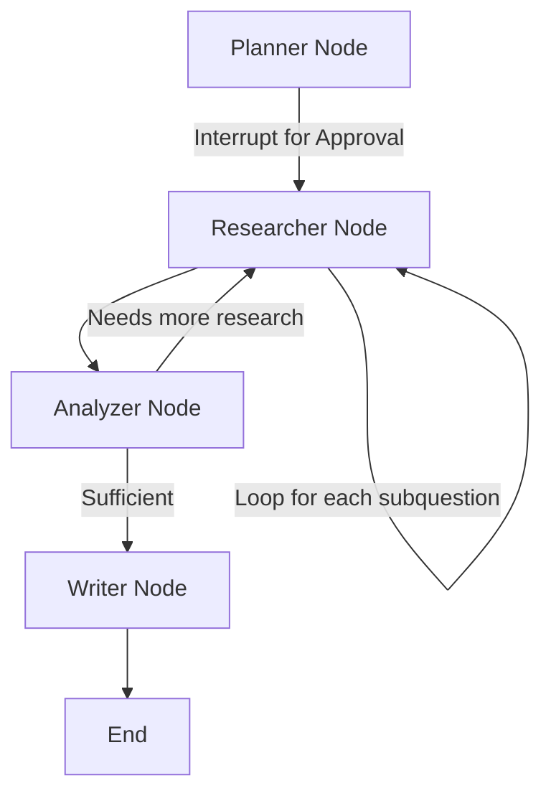

# Multi-Agent Research Assistant

An autonomous research agent built with **LangGraph**, **FastAPI**, and **React**. 

The agent plans a research approach, breaks down the original query into sub-questions, and assigns them to an ensemble of workers. An analyzer then evaluates if the findings satisfy the query, looping back for further research if necessary, before synthesizing a final report.

## Architecture



## Features

- **Human-in-the-Loop**: The agent pauses after planning to allow human review and editing of the research plan.
- **Dynamic Loops**: LangGraph conditional edges enable the analyzer to dynamically route execution back to research if gaps exist.
- **SSE Streaming**: Progress is streamed to the frontend for real-time observability.
- **Robust Tools**: Web search powered by Tavily for AI-tailored search results.

## Setup Instructions

### Backend
1. Navigate to the backend directory:
   ```bash
   cd backend
   ```
2. Create and activate a virtual environment:
   ```bash
   python -m venv .venv
   source .venv/bin/activate  # On Windows: .\.venv\Scripts\Activate.ps1
   ```
3. Install dependencies:
   ```bash
   pip install -e .
   ```
4. Configure environment variables in a `.env` file:
   ```env
   GROQ_API_KEY=your_key
   OPENAI_API_KEY=your_key
   TAVILY_API_KEY=your_key
   ```
5. Start the FastAPI server:
   ```bash
   uvicorn app.main:app --reload
   ```

### Frontend
1. Navigate to the frontend directory:
   ```bash
   cd frontend
   ```
2. Install dependencies:
   ```bash
   npm install
   ```
3. Start the Vite dev server:
   ```bash
   npm run dev
   ```

## Walkthrough

When you ask a question like *"What are the main approaches to reducing LLM hallucination?"*, the agent first generates a plan (e.g., "What is RAG?", "What is fine-tuning?"). It pauses for you to review the plan. Once approved, it uses Tavily to search the web for each question. The analyzer reviews the results and either requests more information or proceeds to the writer. The writer creates a markdown report with inline citations, which is rendered on the React frontend.

### Known Limitations
- The backend uses an in-memory dictionary to track runs (`active_runs`). Data will be lost upon server restart. Use a DB for production.
- A hard cap on `MAX_RESEARCH_LOOPS` is enforced to prevent infinite loops.
- No authentication on the API for this portfolio demo.
